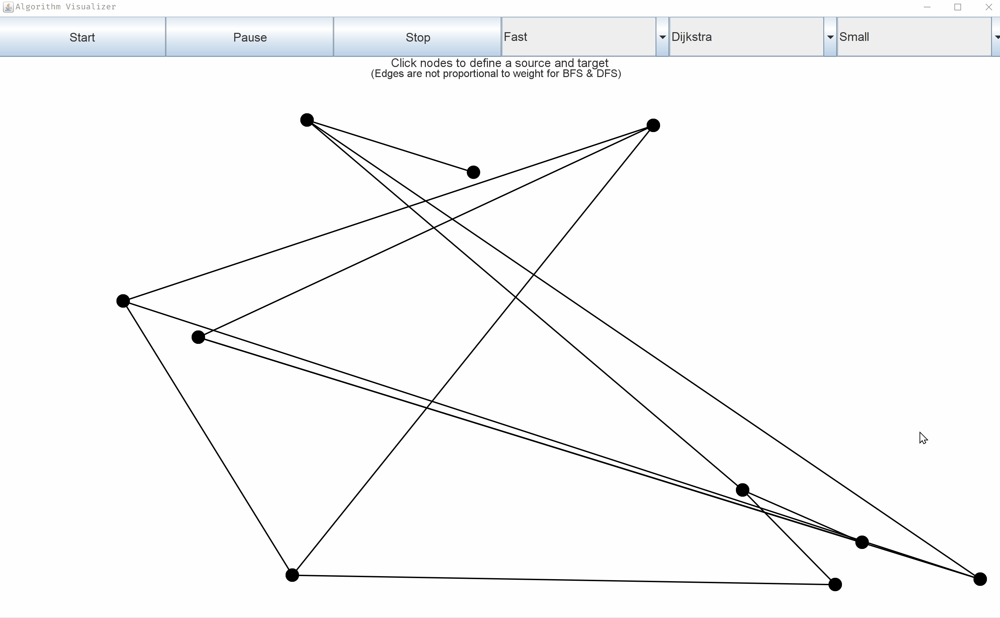
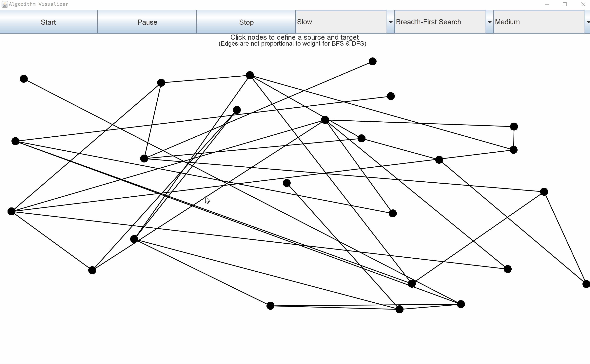
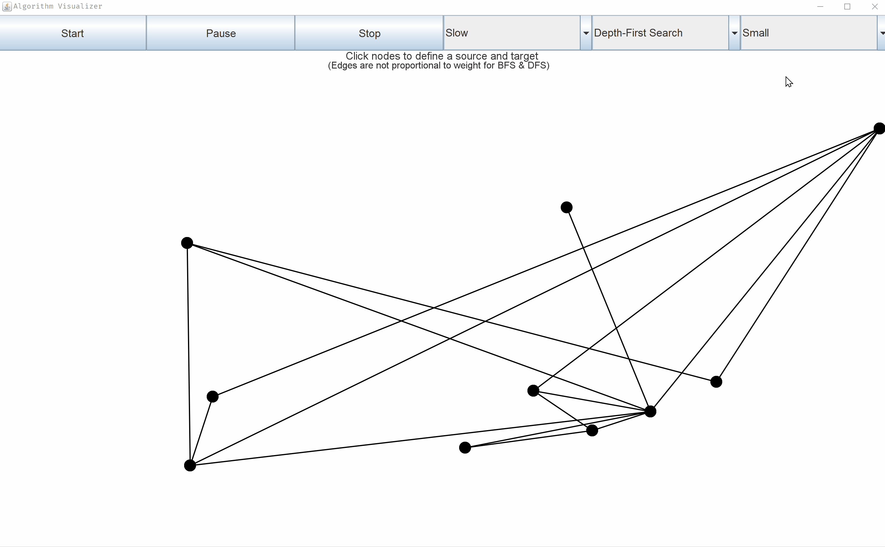
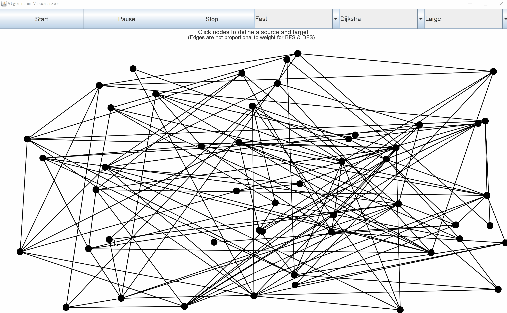
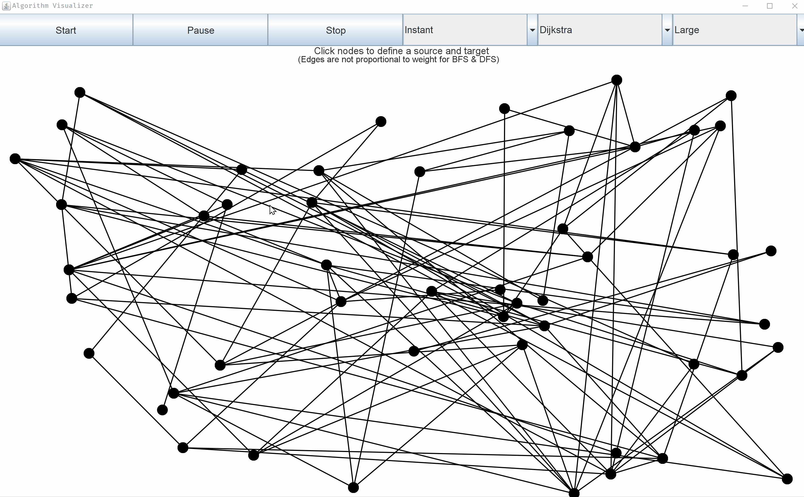
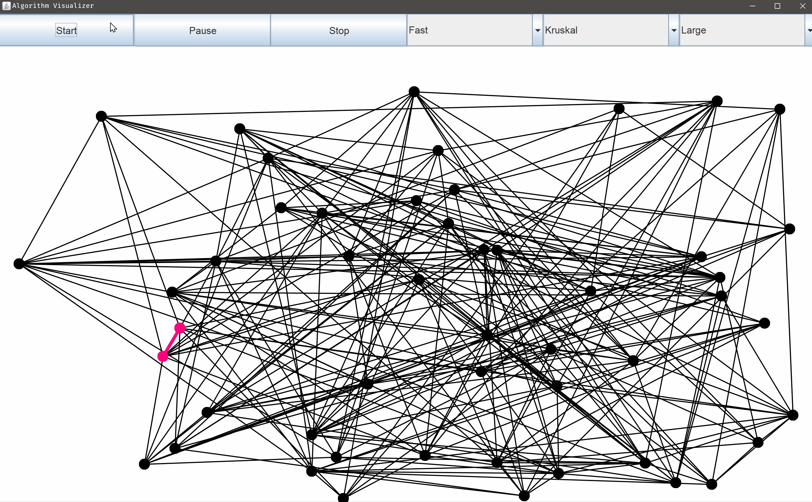
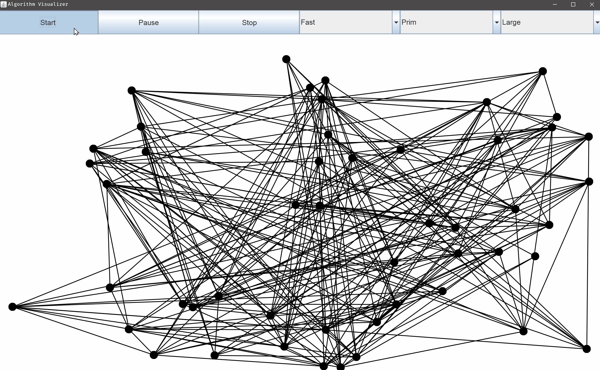
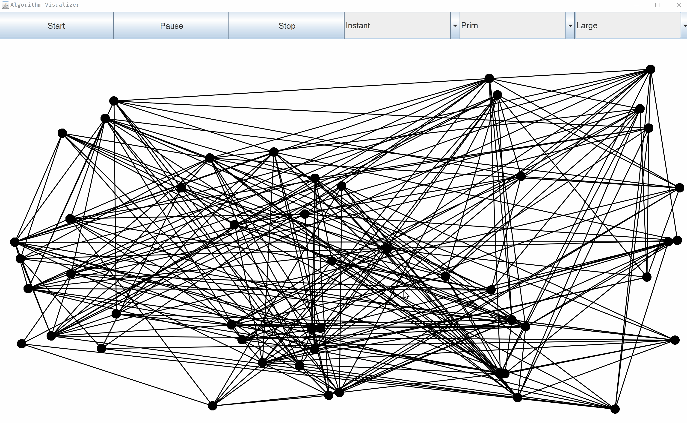

# Shortest Path & MST Algorithm Visualizer

## Table of contents
* [What is a shortest path algorithm?](#What-is-a-shortest-path-algorithm?)
* [Technologies](#technologies)
* [Setup](#setup)
* [Features](#features)
* [Demo](#demo)

## What is a Shortest Path Algorithm?
Optimally, a shortest path algorithm finds a path between a source node and target node
such that the total weight of the path is minimized. In other words, let's designate major
United States cities as nodes. Perhaps the start node is _Boston_ and the target node is
_Dallas_. Let's pretend there isn't a direct path from Boston to Dallas, and we must travel
directly to and from major cities. Therefore, the shortest path would be some collection
of cities between Boston and Dallas such that the total distance traveled from start to
finish is minimized.

One such path may be:
 _Boston_ --> NYC --> Philadelphia --> Washington DC --> Nashville --> _Dallas_

 ## What is a Minimum Spanning Tree? (MST)
 A MST algorithm finds a tree of paths that connect all nodes such that the total weight of
 the tree is minimized. For example, pretend that we have 50 cities and there are a total of
 200 individual direct _edges_ between arbitrary pairs of cities. A MST algorithm will find
 a tree of _edges_ that connects every city such that the combined weights of all _edges_ in
 the tree is minimized. Another way to think of the produced tree, is that it's a path to
 visit every city such that the total distance traveled is minimized.

## Technologies
Application was built with:
- [Java SE 15.0.1](https://docs.oracle.com/en/java/javase/15)
- [JGraphT 1.5.0](https://jgrapht.org)

## Setup
If you don't currently have Java SE 15 (or newer) installed on your system,
then please install [JDK 15](https://www.oracle.com/java/technologies/javase-jdk15-downloads.html).

All other dependencies are packaged into the .JAR executable, which can be found [here](https://github.com/ryanalbertson/Algorithm_Visualizer/releases).

The application can be launched by executing _Algorithm_Visualizer.jar_.

## Features
- Randomly generate different sized connected directed graphs
- Animate shortest path and MST algorithms
  - Breadth-First Search
  - Depth-First Search
  - Dijkstra's Algorithm
  - Kruskal's Algorithm
  - Prim's Algorithm
- Select source and target nodes
- Start/Stop/Pause algorithm animations
- Change speed of animations _(slow/fast/instant)_

## Demo
> User selecting different graph sizes, which randomly generates them each time.
> 

> Slow Bread-First Search on a medium graph. Edge weights are ignored.
> 

> Slow Depth-First Search on a small graph. It's an extremely inaccurate implementation.
> 

> Fast Dijkstra's algorithm on a large graph.
> 

> Instant Dijkstra's algorithm on a large graph.
> 

> Fast Kruskal's algorithm on a large graph.
> 

> Fast Prim's algorithm on a large graph.
> 

> Instant Prim's algorithm on a large graph.
> 
