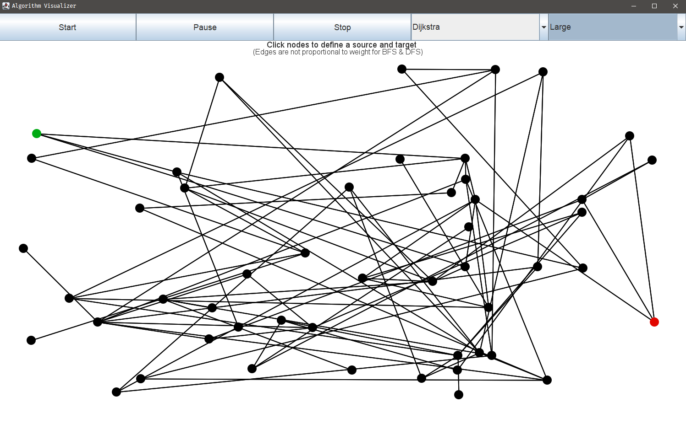
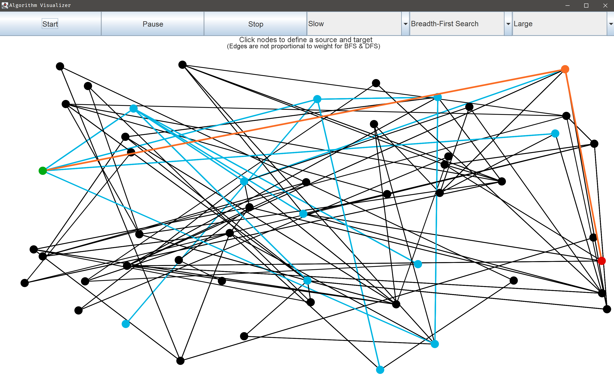
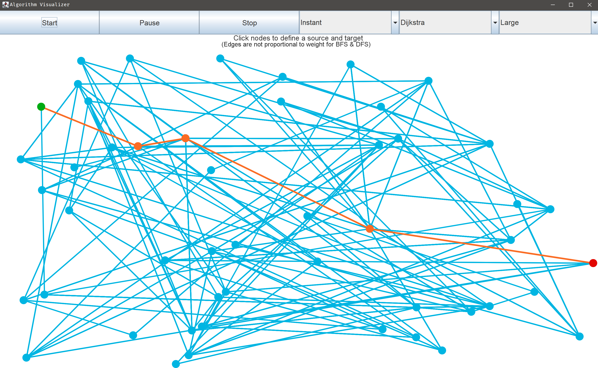

# Shortest Path Algorithm Visualizer

## Table of contents
* [What is a shortest path algorithm?](#What-is-a-shortest-path-algorithm?)
* [Technologies](#technologies)
* [Setup](#setup)
* [Features](#features)
* [Screenshots](#screenshots)
 

## What is a shortest path algorithm?
Generally, a shortest path algorithm finds a path between a source node and target node
such that the total weight of the path is minimized. In other words, let's designate major
United States cities as nodes. Perhaps the start node is _Boston_ and the target node is
_Dallas_. Let's pretend there isn't a direct path from Boston to Dallas, and we must travel
directly to and from major cities. Therefore, the shortest path would be some collection
of cities between Boston and Dallas such that the total distance traveled from start to
finish is minimized.

One such path may be:
 _Boston_ --> NYC --> Philadelphia --> Washington DC --> Nashville --> _Dallas_

## Technologies
Application was built with:
- [Java SE 15.0.1](https://docs.oracle.com/en/java/javase/15)
- [JGraphT 1.5.0](https://jgrapht.org)

## Setup
If you don't currently have Java SE 15 (or newer) installed on your system,
then please install [JDK 15](https://www.oracle.com/java/technologies/javase-jdk15-downloads.html).

All other dependencies are packaged into the .JAR executable, which can be found [here](https://github.com/ryanalbertson/Algorithm_Visualizer/releases).

The application can be launched by executing _Algorithm.Visualizer.jar_.

## Features
- Randomly generate different sized connected directed or undirected graphs
- Animate shortest path algorithms
  - Breadth-First Search
  - Depth-First Search
  - Dijkstra's Algorithm
  - Bellman-Ford Algorithm
  - Floyd-Warshall Algorithm
- Select source and target nodes
- Start/Stop/Pause algorithm animations
- Change speed of animations _(slow/fast/instant)_

## Screenshots

>User has selected to randomly generate a _small_ graph and has selected a source node and target node
>

>A _Breadth-First Search_ has started at the selected source node
>

>The _BFS_ has found the target node and drawn the shortest path
>

>Finished _Dijkstra's_ algorithm run on a different graph
>
