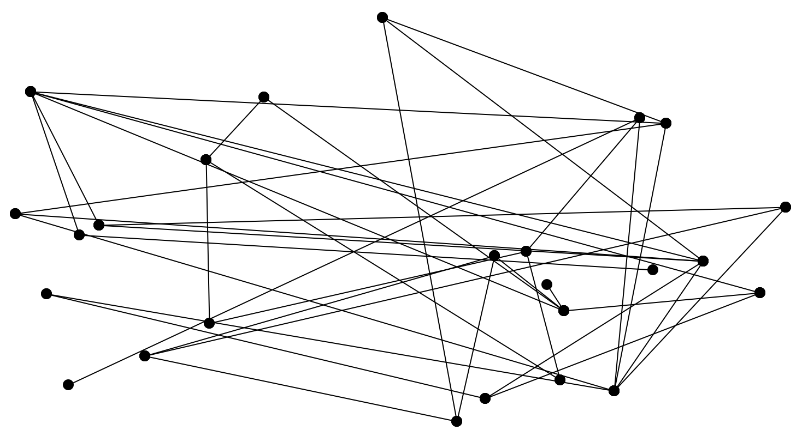
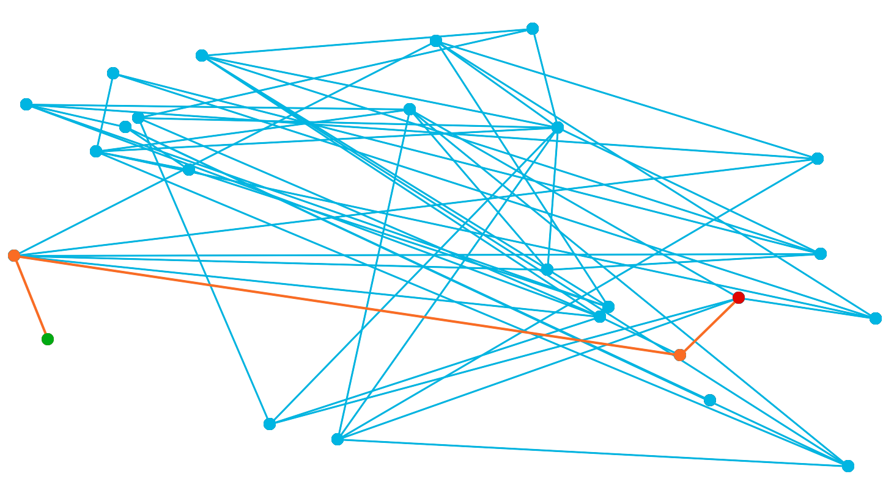
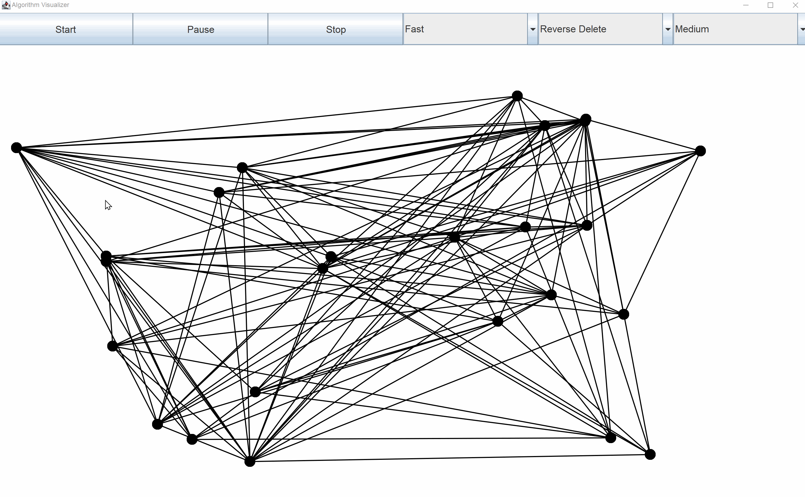

# Algorithm Visualizer
**Software application that runs in the Java Runtime Environment and provides interactive algorithm animations. 
Users can learn and practice with assorted search, shortest path  and minimum spanning tree algorithms.**

## Table of contents
* [What is a Graph?](#graph)
* [What is a shortest path algorithm?](#shortest_path)
* [What is a Minimum Spanning Tree (MST)?](#mst)
* [Setup](#setup)
* [Features](#features)
* [Demo](#demo)

## What is a Graph?
In general terms, a graph refers to a network of nodes (_dots_) that are connected by edges (_lines_). There's an 
 entire field of research about graphs, namely graph theory. For instance, the direction of edges is a often a 
 significant consideration, but we will disregard it for this software. 
 To learn a some more about graph terminology, [click here.](http://web.cecs.pdx.edu/~sheard/course/Cs163/Doc/Graphs.html)

> Example of a graph
> 

## What is a Shortest Path?
A shortest path is a path between a designated source node and target node within a graph. The path is an ordering 
of nodes that starts from the source and ends at the target. The nodes in the path are connected by edges. These 
edges each have a respective weight. The shortest path will be the path of nodes between the source and target that 
minimizes the total weight of all edges connecting those path nodes.

> Let our graph have nodes that represent US cities. The edges between those nodes are select roads that travel 
between the cities. Each road has an associated distance, this is the edge weight. Let's say our source node is 
Boston and our target node is Dallas. We want the shortest path between the two cities, given our graph of cities 
and roads. Such a path will indeed span between the two cities, but it will also be the least distance out of all 
possible paths between Boston and Dallas.
>
>Perhaps the shortest path is:
 _Boston_ --> NYC --> Philadelphia --> Washington DC --> Nashville --> _Dallas_

 > Example of a shortest path between two nodes in a graph
> 

## What is a Minimum Spanning Tree? (MST)
To understand what a minimum spanning tree is, we must first define what a tree is. Let's simply define a tree as a 
subgraph of some parent graph such that:

- Every node from the parent graph exists in the tree.
- Every node is connected to every node. There's a path between any pair of nodes in the tree.
- There are no cycles. Meaning that there isn't a path that can start and finish at the same node.

Considering all this, a minimum spanning tree is just a tree that minimizes the total edge weights within it.

> Using the cities and roads analogy, a MST would be a collection of roads that together connect every city and the 
sum of distances of these roads is the least possible such that all cities are still linked together with this network 
of roads.

> Example of the minimum spanning tree of a graph
> 

## Setup
[Here is the download](https://github.com/RyanAlbertson/Algorithm_Visualizer/releases/tag/v1.0.4) for the application. Look for _Algorithm.Visualizer.exe_ under _Assets_.

If you don't currently have Java SE 11 (or newer) installed on your system, then please 
install the [JDK 11](https://www.oracle.com/java/technologies/javase-jdk11-downloads.html).

This application also uses [JGraphT](https://jgrapht.org), but it's included with the download.

The application is launched by executing _Algorithm.Visualizer.exe_

## Features
- Randomly generate various sized undirected connected graphs
- Control animations of search, shortest path, and MST algorithms
  - Depth-First Search
  - Breadth-First Search
  - Dijkstra's Algorithm
  - A* Search
  - Bellman-Ford
  - Floyd-Warshall
  - Reverse Delete
  - Kruskal's Algorithm
  - Prim's Algorithm
- Start/Stop/Pause algorithm animations
- Change speed of animations _(Slow/Fast/Instant)_

## Demo
> Generating random different sized graphs
> 

> Slow Depth-First Search on a small graph
> 

> Slow Bread-First Search on a medium graph
> 

> Fast Dijkstra's algorithm on a large graph
> 

> Instant Dijkstra's algorithm on large graphs
> 

> Slow A* Search algorithm on a large graph
> 

> Fast Bellman-Ford algorithm on a medium graph
> 

> Fast Floyd-Warshall algorithm on a small graph
> 

> Fast Kruskal's algorithm on a large graph
> 

> Fast Prim's algorithm on a large graph
> 

> Instant Prim's algorithm on assorted graphs
> 

> Fast Reverse Delete on a medium graph
> 

[Return to Top](#top)
